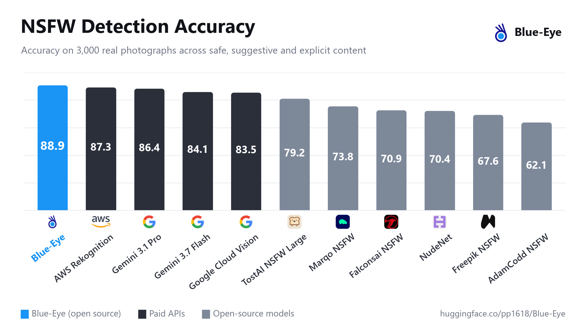

<p align="center">
  
</p>

<h1 align="center">Blue-Eye</h1>

<p align="center">
  Open-weights image classifier for content moderation: <b>safe</b>, <b>suggestive</b> or <b>explicit</b>.<br>
  <a href="https://huggingface.co/pp1618/Blue-Eye">Model on Hugging Face</a>
</p>

Blue-Eye predicts whether an image is safe, suggestive or explicit, with a probability for each class.
It is a DINOv3 ViT-L/16 fine-tuned end to end at 512x512 on about 2.6 million images, and it handles
both real photographs and anime/illustration.

On a benchmark of 3,000 real photographs, Blue-Eye reaches **88.9% accuracy**, ahead of AWS
Rekognition (87.3%), Gemini 3.1 Pro (86.4%), Google Cloud Vision (83.5%) and every open-source NSFW
detector it was compared with. All systems were evaluated on the same images.



The weights (1.2 GB) are hosted on [Hugging Face](https://huggingface.co/pp1618/Blue-Eye); this
repository contains the inference code. Full evaluation details are in the model card.

## Quick start

```bash
git clone https://github.com/prnshu-p/Blue-Eye.git
cd Blue-Eye
pip install -r requirements.txt huggingface_hub
```

The weights are gated: open the [model page](https://huggingface.co/pp1618/Blue-Eye), click
"Agree and download" once, then log in with `hf auth login`.

```python
from huggingface_hub import snapshot_download
from inference import classify

path = snapshot_download("pp1618/Blue-Eye")

for result in classify(["photo.jpg", "drawing.png"], model=path):
    print(result["label"], result["probabilities"])
```

From the command line:

```bash
python inference.py photo.jpg folder_of_images/ --model pp1618/Blue-Eye --device cuda
```

Add `--precision bf16` on GPUs with bfloat16 support for faster inference.

## Classes

| Class | Covers |
|---|---|
| `safe` | no sexualised content, including swimwear, fitness, medical images and non-sexual art |
| `suggestive` | sexualised but not explicit, such as posed lingerie shots |
| `explicit` | exposed genitalia, sexual acts or full nudity |

## Intended use

Blue-Eye is built for moderating sexual content: filtering feeds and search results, blurring images,
age-gating adult content, prioritising images for human review, and curating datasets. It covers
sexual content only and is not intended for age estimation, child-safety detection, or monitoring
individual people.

## License

Built on Meta's DINOv3 and released under the
[DINOv3 License](https://ai.meta.com/resources/models-and-libraries/dinov3-license) (see `LICENSE`).
Commercial use is permitted under its terms.

## Citation

```bibtex
@misc{patel2026blueeye,
  title  = {Blue-Eye: a content-safety image classifier},
  author = {Patel, Pranshu},
  year   = {2026},
  url    = {https://huggingface.co/pp1618/Blue-Eye}
}
```
